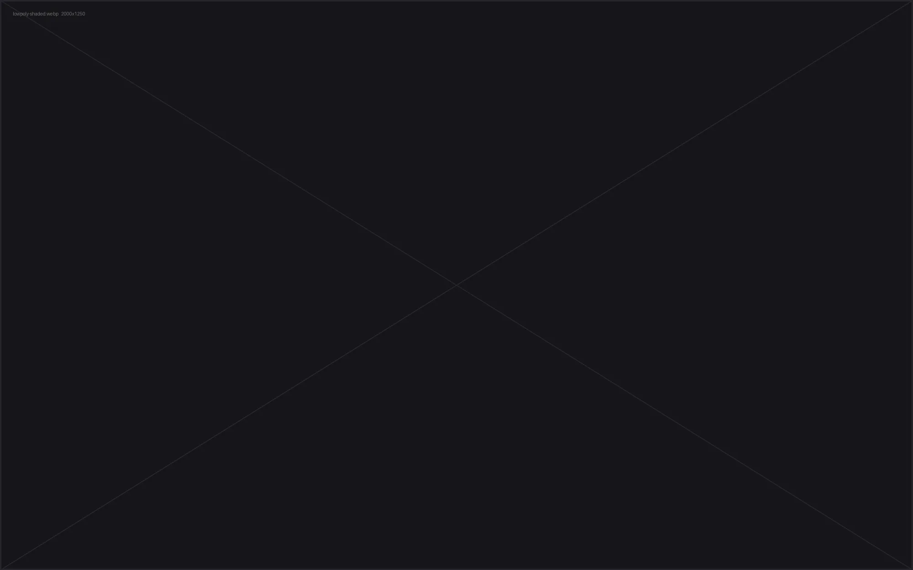
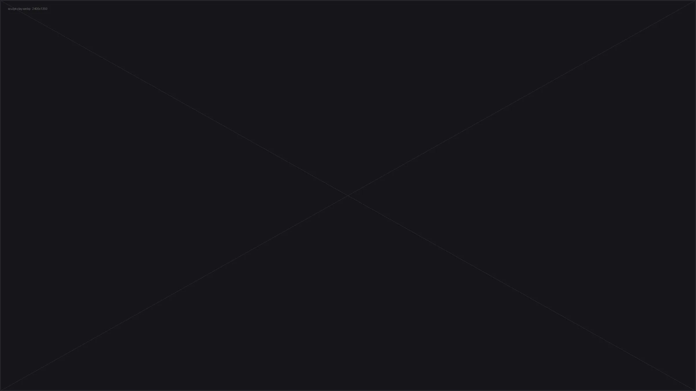
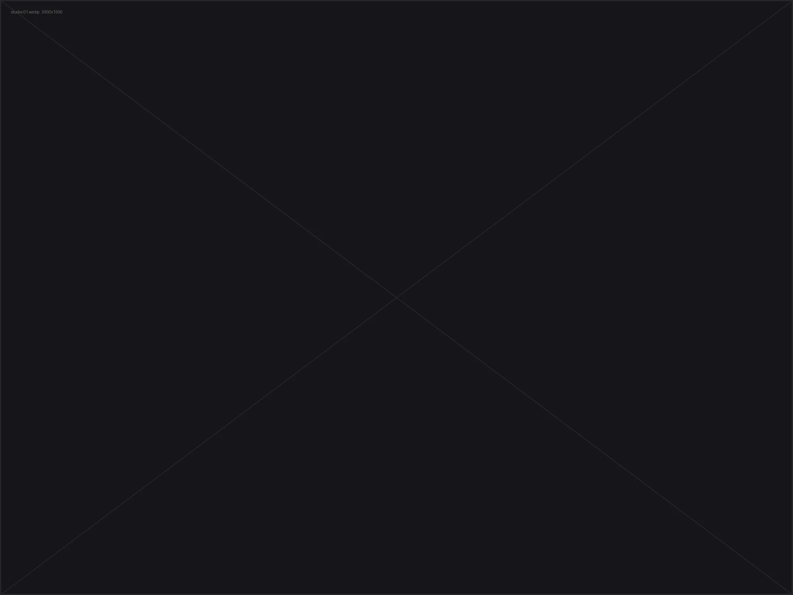
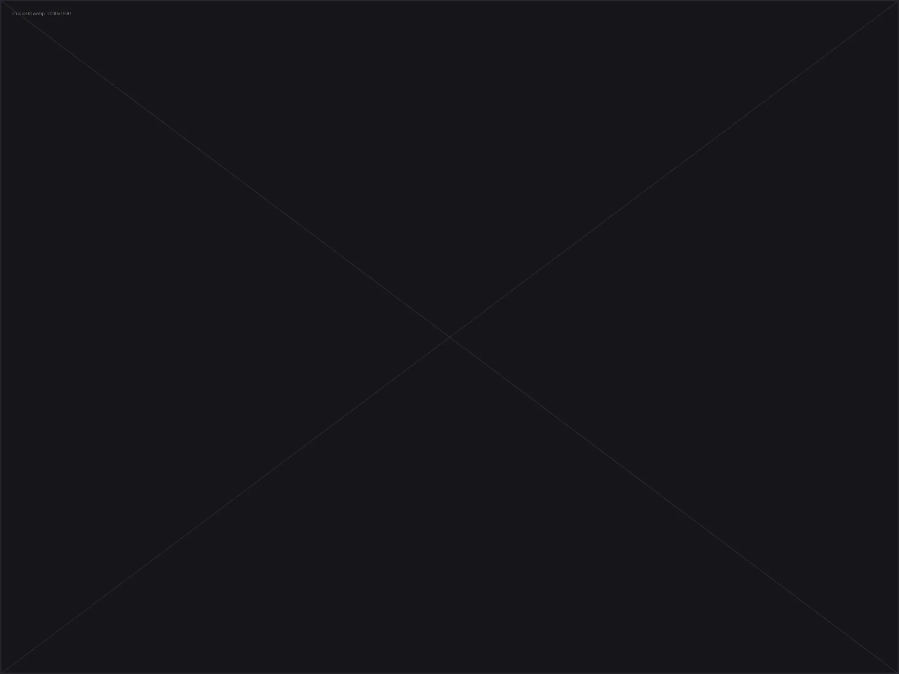
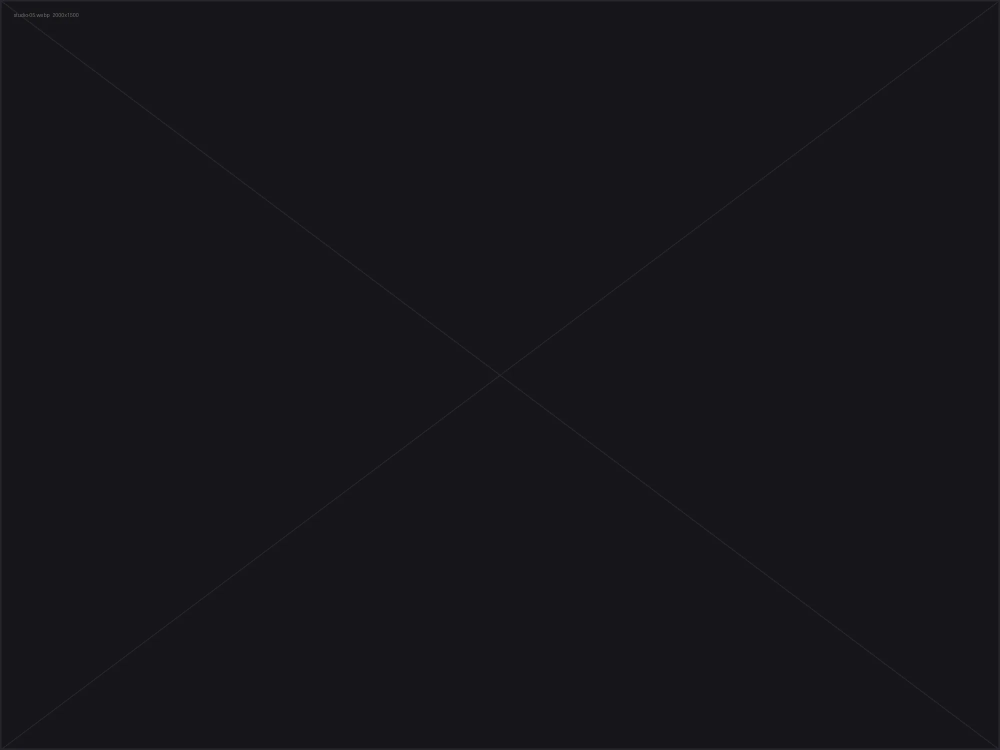
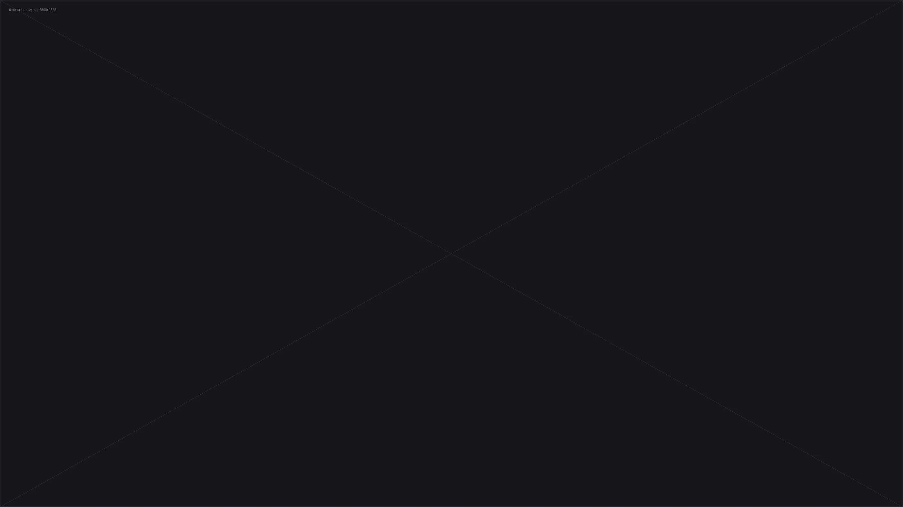
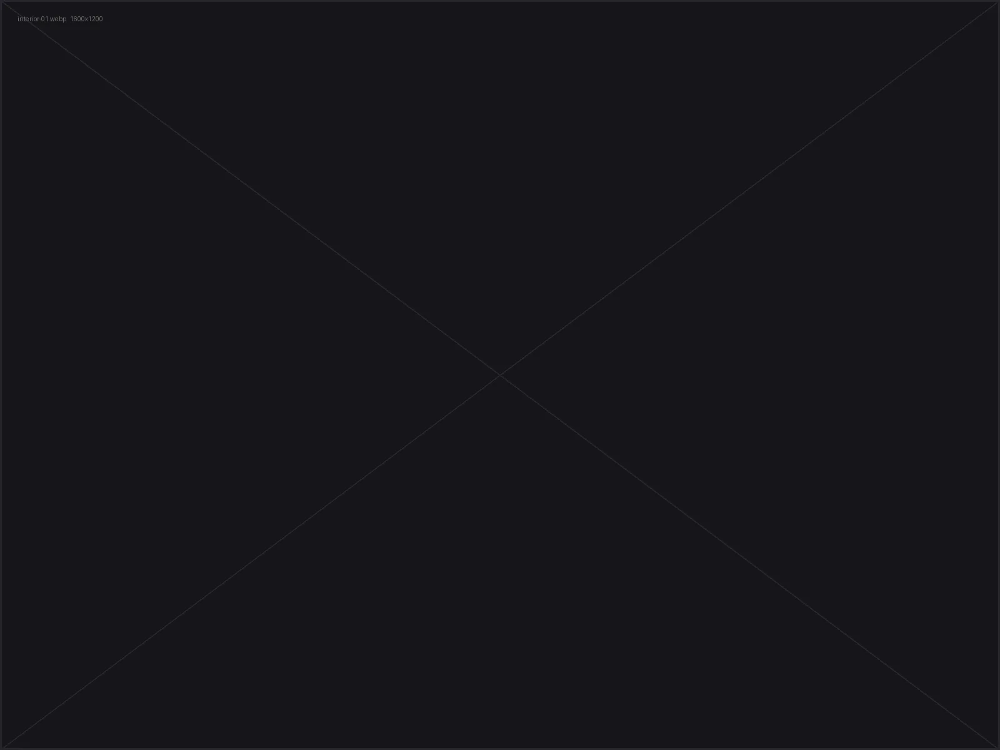
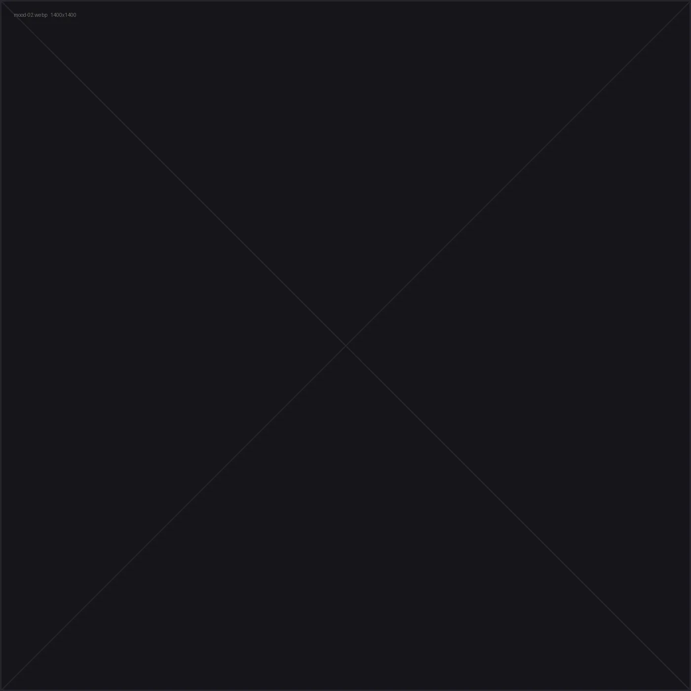

# PLINTH / 001 — One-page case study
**Briefing técnico + código completo para colar no VS Code**

Documento gerado em 09/09/2026 · página em inglês · stack: HTML + CSS + JS puro + three.js (CDN)

---

## 0. Como usar este arquivo

1. Crie a pasta do projeto (ex. `plinth-case-study/`) e abra no VS Code.
2. Crie a árvore de pastas da **seção 4**.
3. Copie cada bloco de código da **seção 6** para o arquivo com o nome indicado no título do bloco.
4. Rode `python3 tools/make-placeholders.py` (seção 6.5) — a página já abre inteira, com placeholders no lugar dos renders.
5. Vá substituindo os placeholders pelos arquivos reais, **mantendo os mesmos nomes** (seção 5).
6. Extensão **Live Server** → *Go Live*. Antes de mandar pro cliente, rode o QA da seção 10.

> Tudo que é texto da página está em inglês e pronto pra usar. Os números técnicos (18.4k quads, 4.1M tris, 5 dias, etc.) são **placeholders plausíveis** — troque pelos seus reais antes de publicar. Ninguém contrata por número inflado, e um número errado é a primeira coisa que um lead percebe.

---

## 1. O que eu mudei na sua ideia (e por quê)

Sua estrutura estava certa: vídeo → fases → resultados → viewer 3D. O que faltava era a lógica de **quem vai ler**. Um lead de modelagem abre a página, dá 40 segundos de atenção e procura três coisas: *a topologia é limpa?*, *a forma está correta?*, *ele entende pipeline?*. A página foi montada pra responder isso sem que ele precise procurar.

| Sua ideia | O que está implementado | Motivo |
|---|---|---|
| Vídeo abrindo a página | Loop **mudo** em background + botão "Watch the film" que abre o filme com áudio num modal | Browser bloqueia autoplay com som. Loop mudo dá vida ao hero; o filme narrado toca quando o cliente escolhe. |
| Fases 1–5 em divs | Fases numeradas **01–07** com rail de número, nav com scroll-spy e barra de progresso | O cliente sempre sabe em que etapa está e quanto falta. Vira leitura, não scroll infinito. |
| — | Seção **"The brief"** antes da fase 01 | Processo sem problema declarado parece decoração. Duas frases enquadrando o desafio valem mais que dez imagens. |
| Low-poly em imagens | **Slider de comparação** shaded ↔ wireframe (mouse, touch e teclado) | Em teste de modelagem a topologia *é* a entrevista. Deixar o wireframe atrás de um drag é a prova mais forte da página. |
| — | **Stats** de polycount, quad ratio, subdiv, UV sets | Números objetivos param a dúvida antes dela nascer. |
| Renders de studio | Grid + **lightbox** com teclado (←/→/Esc) e swipe, mais o rig de luz descrito | Ele vai querer ver 100%. E vai reparar se você sabe descrever a própria luz. |
| Cena de interior | Uma imagem **full-bleed** (borda a borda) + grid de 4 câmeras com lente/hora | Full-bleed dá escala; a legenda técnica mostra intenção fotográfica, não sorte. |
| "uma imagem de moods diferentes" | Faixa de **5 moods nomeados** (Riviera, Atelier, Club, Foundry, Salon) com material descrito | Nomear vira coleção, não teste. E reforça a mensagem: mesma geometria, mesmas UVs, só material. |
| Sketchfab / three.js | Viewer three.js com **fallback triplo**: `.glb` → turntable de imagens → proxy em blocos, mais watchdog de 7s se o CDN cair | Buraco cinza na frente do cliente é pior que não ter viewer. Aqui sempre aparece algo. |
| — | **Specs table + trade-offs + "what I'd do next"** | A seção que separa artista de artista sênior. Assumir escolhas e limites lê como maturidade de pipeline. |
| — | Downloads (breakdown PDF, turntable MP4, wireframe sheet) | Lead sempre quer levar algo pra reunião interna. |

Extras já embutidos: lazy loading em todas as imagens, `prefers-reduced-motion`, foco visível e navegação por teclado, Open Graph pra preview no Slack/WhatsApp, CSS de impressão (se ele gerar PDF, não sai preto), zero dependência além do three.js.

---

## 2. Mapa da página

```
┌─ nav fixa ─────────── barra de progresso + scroll-spy ──────────────┐
│                                                                     │
│ HERO            vídeo em loop mudo · título · 4 fatos · CTA filme   │
│ THE BRIEF       o problema em 2 parágrafos + 4 pilares              │
│ 01 RESEARCH     board de referências (6) + 3 notas de decisão       │
│ 02 LOW-POLY     compare shaded/wireframe + stats + 3 detalhes       │
│ 03 SCULPT       clay render grande + 3 macros + 3 notas             │
│ 04 STUDIO       galeria 6 imagens + descrição do rig de luz         │
│ 05 INTERIOR     full-bleed + 4 câmeras (lente/f/hora)               │
│ 06 MOODS        5 variações nomeadas com material                   │
│ 07 3D VIEWER    three.js (orbit, wireframe, front/3-4/side/top)     │
│ SPECS           tabela técnica + trade-offs + downloads             │
│ FOOTER          nome, função, contato                               │
└─────────────────────────────────────────────────────────────────────┘
```

**Ordem narrativa:** problema → o que eu olhei → como construí → como detalhei → como iluminei → como se comporta no mundo real → o que dá pra fazer com isso → ficha técnica. Nunca começa por render bonito: começa por raciocínio.

---

## 3. Roteiro do filme de abertura (1:10)

Duas peças de vídeo saem do mesmo material:

- **`story-loop.mp4/.webm`** — 12 s, mudo, em loop no hero. Um único movimento lento (dolly ou orbit curto) no render final. Sem corte, sem texto.
- **`story.mp4`** — o filme narrado de 1:10 que abre no modal.

### Shot list

| Tempo | Imagem | Narração (VO) | Texto na tela |
|---|---|---|---|
| 0:00–0:07 | Preto → macro do tecido entrando de foco, luz rasante | "Every chair is an argument about weight." | — |
| 0:07–0:18 | Board de referências, pan lateral, marcações aparecendo | "Mine had to be heavy at the floor and light at the shoulders." | `01 RESEARCH` |
| 0:18–0:30 | Wireframe girando, edge loops acendendo por região | "So I built the cage first. All quads, edge flow following the seams." | `02 LOW-POLY · 18.4k quads` |
| 0:30–0:42 | Morph low-poly → sculpt, foco na almofada cedendo | "Then the parts that make it upholstery: tension, gravity, compression." | `03 SCULPT · 4.1M tris` |
| 0:42–0:52 | Studio: key acendendo, depois fill, depois rim | "One soft key, one bounce, one rim. Light that shows form instead of flattering it." | `04 STUDIO` |
| 0:52–1:03 | Corte pra cena de interior, luz de janela, orbit lento | "And then the real test — a room, at four in the afternoon." | `05 INTERIOR` |
| 1:03–1:10 | Cinco moods em corte rápido, fecha no bouclé/nogueira | "Same geometry. Five stories." | `PLINTH / 001` |

Notas de produção: fale em ritmo lento, ~110 palavras no total. Trilha só de ambiência (room tone + um pad grave), nada épico. Se não quiser gravar voz, mantenha só os cartões de texto e a trilha — funciona igual e evita sotaque forçado num teste em inglês. Legenda em `assets/video/story.en.vtt` (o `<track>` já está no HTML) — legenda também resolve o cliente que assiste sem som.

### Compressão

```bash
# loop do hero: 12 s, sem áudio, mp4 + webm
ffmpeg -i story-master.mov -t 12 -an -vf "scale=1920:-2" \
  -c:v libx264 -crf 24 -preset slow -pix_fmt yuv420p -movflags +faststart \
  assets/video/story-loop.mp4

ffmpeg -i story-master.mov -t 12 -an -vf "scale=1920:-2" \
  -c:v libvpx-vp9 -crf 34 -b:v 0 -row-mt 1 assets/video/story-loop.webm

# filme completo com áudio
ffmpeg -i story-master.mov -vf "scale=1920:-2" \
  -c:v libx264 -crf 20 -preset slow -pix_fmt yuv420p \
  -c:a aac -b:a 160k -movflags +faststart assets/video/story.mp4

# poster (frame 120)
ffmpeg -i story-master.mov -vf "select=eq(n\,120),scale=2560:-2" -frames:v 1 \
  assets/video/story-poster.jpg
```

Alvos: loop ≤ 4 MB, filme ≤ 25 MB. Se o filme passar disso, suba no Vimeo/YouTube e troque o `<video>` do modal por um `<iframe>` — não vale queimar a primeira impressão em buffering.

---

## 4. Estrutura de pastas

```
plinth-case-study/
├── index.html
├── assets/
│   ├── css/
│   │   └── style.css
│   ├── js/
│   │   ├── main.js
│   │   └── viewer.js
│   ├── img/
│   │   ├── research/    ref-01..06.webp
│   │   ├── lowpoly/     lowpoly-shaded.webp · lowpoly-wire.webp · lowpoly-detail-01..03.webp
│   │   ├── sculpt/      sculpt-clay.webp · sculpt-detail-01..03.webp
│   │   ├── studio/      studio-01..06.webp
│   │   ├── interior/    interior-hero.webp · interior-01..04.webp
│   │   ├── moods/       mood-01..05.webp
│   │   └── turntable/   frame-001..036.webp
│   ├── video/           story-loop.mp4 · story-loop.webm · story.mp4 · story-poster.jpg · story.en.vtt
│   └── model/           chair.glb
├── downloads/           plinth-breakdown.pdf · plinth-turntable.mp4 · plinth-wireframe-sheet.pdf
└── tools/
    └── make-placeholders.py
```

---

## 5. Checklist de assets

Os nomes abaixo estão **hard-coded no HTML**. Renomeie os seus renders pra eles e nada quebra.

| Arquivo | O que é | Proporção / px | Formato |
|---|---|---|---|
| `video/story-loop.mp4` + `.webm` | loop mudo do hero, 12 s | 16:9 · 1920 | H.264 + VP9 |
| `video/story.mp4` | filme narrado 1:10 | 16:9 · 1920 | H.264 + AAC |
| `video/story-poster.jpg` | frame de capa do hero/modal | 16:9 · 2560 | JPG q80 |
| `video/story.en.vtt` | legenda do filme | — | WebVTT |
| `img/research/ref-01..06.webp` | board de referência (01 é o retrato alto) | 1:1 · 1400 | WebP q82 |
| `img/lowpoly/lowpoly-shaded.webp` | base mesh shaded, **mesma câmera** do wire | 16:10 · 2000 | WebP q85 |
| `img/lowpoly/lowpoly-wire.webp` | base mesh wireframe, **mesma câmera** | 16:10 · 2000 | WebP q85 |
| `img/lowpoly/lowpoly-detail-01..03.webp` | braço · ombro · plinto (wire) | 4:3 · 1400 | WebP q82 |
| `img/sculpt/sculpt-clay.webp` | clay render do high-poly | 16:9 · 2400 | WebP q85 |
| `img/sculpt/sculpt-detail-01..03.webp` | piping · dobras do assento · costura | 4:3 · 1400 | WebP q82 |
| `img/studio/studio-01..06.webp` | 01 e 06 aparecem largos no grid | 4:3 · 2000 | WebP q85 |
| `img/interior/interior-hero.webp` | full-bleed, a imagem mais importante da página | 16:9 · 2800 | WebP q85 |
| `img/interior/interior-01..04.webp` | câmeras B–E | 4:3 · 1600 | WebP q82 |
| `img/moods/mood-01..05.webp` | Riviera · Atelier · Club · Foundry · Salon | 1:1 · 1400 | WebP q85 |
| `img/turntable/frame-001..036.webp` | 360º de 10 em 10 graus (fallback do viewer) | 1:1 · 1400 | WebP q80 |
| `model/chair.glb` | mesh web, Draco, ≤ 8 MB | — | GLB |
| `downloads/*` | breakdown PDF, turntable MP4, wireframe sheet | — | — |

> A ordem das 5 imagens de mood no HTML segue exatamente os seus renders: **01** ivory canvas + navy piping + carvalho whitewashed, **02** couro cinza + carvalho claro, **03** couro conhaque + nogueira, **04** linho cru + bronze patinado, **05** bouclé creme + nogueira.

**Conversão em lote pra WebP:**

```bash
# ImageMagick
magick mogrify -format webp -quality 85 -resize 2000x2000\> *.png

# ou cwebp, arquivo por arquivo
for f in *.png; do cwebp -q 85 "$f" -o "${f%.png}.webp"; done
```

**Turntable a partir de um render 360 de 36 frames:**

```bash
ffmpeg -i turntable.mp4 -vf "fps=36/12,scale=1400:-2" assets/img/turntable/frame-%03d.webp
```

---

## 6. Código

### `index.html`

```html
<!DOCTYPE html>
<html lang="en">
<head>
<meta charset="utf-8">
<meta name="viewport" content="width=device-width, initial-scale=1">
<title>PLINTH — Lounge Chair · 3D Modeling Study</title>
<meta name="description" content="Full production breakdown of the PLINTH lounge chair: reference research, low-poly base, high-poly sculpt, studio lighting, interior scene and material moods.">
<meta name="theme-color" content="#0a0a0b">

<!-- Open Graph (troque a URL absoluta quando publicar) -->
<meta property="og:type" content="website">
<meta property="og:title" content="PLINTH — Lounge Chair · 3D Modeling Study">
<meta property="og:description" content="From reference board to production-ready asset. Modeling, sculpt, lookdev and rendering breakdown.">
<meta property="og:image" content="assets/img/studio/studio-01.webp">

<link rel="preconnect" href="https://fonts.googleapis.com">
<link rel="preconnect" href="https://fonts.gstatic.com" crossorigin>
<link href="https://fonts.googleapis.com/css2?family=Instrument+Serif:ital@0;1&family=Inter:wght@300;400;500&display=swap" rel="stylesheet">
<link rel="stylesheet" href="assets/css/style.css">
</head>
<body>

<div class="progress" aria-hidden="true"><span id="progressBar"></span></div>

<header class="nav" id="nav">
  <a class="nav__brand" href="#top">
    <span class="nav__mark">◼</span>
    <span>PLINTH <em>/ 001</em></span>
  </a>

  <button class="nav__toggle" id="navToggle" aria-expanded="false" aria-controls="navMenu">
    <span></span><span></span>
    <span class="sr-only">Menu</span>
  </button>

  <nav class="nav__menu" id="navMenu" aria-label="Sections">
    <a class="nav__link" href="#overview">Overview</a>
    <a class="nav__link" href="#research">01 Research</a>
    <a class="nav__link" href="#lowpoly">02 Low-poly</a>
    <a class="nav__link" href="#sculpt">03 Sculpt</a>
    <a class="nav__link" href="#studio">04 Studio</a>
    <a class="nav__link" href="#interior">05 Interior</a>
    <a class="nav__link" href="#moods">06 Moods</a>
    <a class="nav__link" href="#viewer">3D</a>
    <a class="nav__link nav__link--cta" href="#specs">Specs</a>
  </nav>
</header>

<main id="top">

  <!-- ═══════════════ HERO / FILM ═══════════════ -->
  <section class="hero" id="hero">
    <video class="hero__video" id="heroLoop"
           autoplay muted loop playsinline preload="metadata"
           poster="assets/video/story-poster.jpg">
      <source src="assets/video/story-loop.webm" type="video/webm">
      <source src="assets/video/story-loop.mp4" type="video/mp4">
    </video>
    <div class="hero__scrim"></div>

    <div class="hero__inner">
      <p class="eyebrow" data-reveal>Modeling test — final round</p>
      <h1 class="hero__title" data-reveal>
        A chair,<br><em>told from the inside out.</em>
      </h1>
      <p class="hero__lede" data-reveal>
        PLINTH is a low, soft-shouldered lounge chair on a solid timber plinth.
        This page follows the whole build — reference to render — in the order it happened.
      </p>
      <div class="hero__actions" data-reveal>
        <button class="btn btn--primary" id="playFilm">
          <svg viewBox="0 0 24 24" width="14" height="14" aria-hidden="true"><path d="M8 5v14l11-7z" fill="currentColor"/></svg>
          Watch the film <span class="btn__meta">1:10</span>
        </button>
        <a class="btn btn--ghost" href="#overview">See the process</a>
      </div>
    </div>

    <dl class="hero__facts" data-reveal>
      <div><dt>Role</dt><dd>Modeling · Lookdev · Render</dd></div>
      <div><dt>Software</dt><dd>Blender · ZBrush · Substance</dd></div>
      <div><dt>Duration</dt><dd>5 days</dd></div>
      <div><dt>Deliverable</dt><dd>Production-ready asset</dd></div>
    </dl>

    <a class="hero__cue" href="#overview" aria-label="Scroll down"><span></span></a>
  </section>

  <!-- Modal do filme com áudio -->
  <div class="modal" id="filmModal" role="dialog" aria-modal="true" aria-label="The story of the chair" hidden>
    <button class="modal__close" id="filmClose" aria-label="Close">✕</button>
    <div class="modal__frame">
      <video id="filmVideo" controls playsinline preload="none" poster="assets/video/story-poster.jpg">
        <source src="assets/video/story.mp4" type="video/mp4">
        <track kind="captions" src="assets/video/story.en.vtt" srclang="en" label="English" default>
      </video>
    </div>
  </div>

  <!-- ═══════════════ OVERVIEW ═══════════════ -->
  <section class="section section--split" id="overview">
    <div class="section__aside">
      <p class="eyebrow" data-reveal>The brief</p>
    </div>
    <div class="section__body">
      <h2 class="h2" data-reveal>One chair, four hard problems.</h2>
      <p class="lead" data-reveal>
        The test asked for a single upholstered chair, believable at close range and light enough
        to sit in a full interior scene. That splits into four problems: a clean quad base that
        subdivides without pinching, soft-goods that read as fabric and not as geometry,
        a timber base with honest joinery, and a lookdev that survives both studio white and
        a warm interior.
      </p>
      <p data-reveal>
        I worked in that order and kept every stage reviewable — the wireframe, the sculpt,
        the shading breakdown and the render passes are all below, exactly as they came out
        of the pipeline.
      </p>

      <ul class="pillars" data-reveal>
        <li><span>01</span><strong>Silhouette first</strong>Blocking approved before a single detail.</li>
        <li><span>02</span><strong>All-quad topology</strong>Edge flow follows the seams, not the software.</li>
        <li><span>03</span><strong>Soft-goods logic</strong>Compression, gravity and piping done as sculpt, not noise.</li>
        <li><span>04</span><strong>Scene-ready</strong>One asset, five material moods, no re-topology.</li>
      </ul>
    </div>
  </section>

  <!-- ═══════════════ 01 RESEARCH ═══════════════ -->
  <section class="section phase" id="research">
    <header class="phase__head">
      <p class="phase__num" data-reveal>01</p>
      <div>
        <h2 class="h2" data-reveal>Research &amp; reference</h2>
        <p class="lead" data-reveal>
          Two days of looking before one hour of modeling. I built a board around a narrow
          question: what makes a low chair feel heavy at the base and light at the shoulders?
        </p>
      </div>
    </header>

    <div class="board" data-gallery="research" data-reveal>
      <button class="tile tile--tall" data-full="assets/img/research/ref-01.webp" data-caption="Silhouette study — plinth base proportion">
        
      </button>
      <button class="tile" data-full="assets/img/research/ref-02.webp" data-caption="Arm roll and piping detail">
        
      </button>
      <button class="tile" data-full="assets/img/research/ref-03.webp" data-caption="Seat compression under load">
        
      </button>
      <button class="tile" data-full="assets/img/research/ref-04.webp" data-caption="Timber plinth joinery">
        
      </button>
      <button class="tile tile--wide" data-full="assets/img/research/ref-05.webp" data-caption="Fabric weave and sheen targets">
        
      </button>
      <button class="tile" data-full="assets/img/research/ref-06.webp" data-caption="Back-to-arm transition">
        
      </button>
    </div>

    <div class="notes" data-reveal>
      <div class="note">
        <h3>What I kept</h3>
        <p>The continuous shoulder line, the single piping run from arm to back, and a plinth
           that reads as one solid block with a shadow gap under it.</p>
      </div>
      <div class="note">
        <h3>What I dropped</h3>
        <p>Buttoning and heavy tufting — they fight the clean shoulder and cost geometry
           that the brief didn't ask for.</p>
      </div>
      <div class="note">
        <h3>Dimensions locked</h3>
        <p>W 104 · D 92 · H 68 cm · seat height 38 cm. Every later stage was modeled to
           real-world scale in metres.</p>
      </div>
    </div>
  </section>

  <!-- ═══════════════ 02 LOW-POLY ═══════════════ -->
  <section class="section phase" id="lowpoly">
    <header class="phase__head">
      <p class="phase__num" data-reveal>02</p>
      <div>
        <h2 class="h2" data-reveal>Low-poly base mesh</h2>
        <p class="lead" data-reveal>
          Built as one clean quad cage per part — shell, cushions, plinth, feet — so the
          asset stays editable and subdivides predictably. Drag the handle to reveal the wire.
        </p>
      </div>
    </header>

    <div class="compare" data-compare data-reveal>
      
      
      <div class="compare__line" aria-hidden="true"></div>
      <div class="compare__grip" id="cmpGrip" role="slider" tabindex="0"
           aria-label="Reveal wireframe" aria-valuemin="0" aria-valuemax="100" aria-valuenow="50">
        <span></span>
      </div>
      <p class="compare__tag compare__tag--l">Shaded</p>
      <p class="compare__tag compare__tag--r">Wireframe</p>
    </div>

    <dl class="stats" data-reveal>
      <div><dt>Base mesh</dt><dd>18.4k <span>quads</span></dd></div>
      <div><dt>Quad ratio</dt><dd>100<span>%</span></dd></div>
      <div><dt>Subdiv level</dt><dd>2 <span>render</span></dd></div>
      <div><dt>UV sets</dt><dd>3 <span>udim-free</span></dd></div>
    </dl>

    <div class="grid grid--3" data-gallery="lowpoly" data-reveal>
      <button class="tile" data-full="assets/img/lowpoly/lowpoly-detail-01.webp" data-caption="Arm roll — edge flow follows the piping">
        
      </button>
      <button class="tile" data-full="assets/img/lowpoly/lowpoly-detail-02.webp" data-caption="Shoulder transition — no poles, no pinching">
        
      </button>
      <button class="tile" data-full="assets/img/lowpoly/lowpoly-detail-03.webp" data-caption="Plinth and feet — hard-surface bevels">
        
      </button>
    </div>
  </section>

  <!-- ═══════════════ 03 SCULPT ═══════════════ -->
  <section class="section phase" id="sculpt">
    <header class="phase__head">
      <p class="phase__num" data-reveal>03</p>
      <div>
        <h2 class="h2" data-reveal>Sculpt &amp; soft-goods</h2>
        <p class="lead" data-reveal>
          The base mesh is correct but dead. Everything that makes it upholstery happens here:
          seam tension, the cushion sagging where a body sits, folds that start at a seam
          and die into the volume.
        </p>
      </div>
    </header>

    <figure class="figure figure--wide" data-reveal>
      <button class="tile tile--flat" data-gallery="sculpt" data-full="assets/img/sculpt/sculpt-clay.webp" data-caption="High-poly clay render — 4.1M tris">
        
      </button>
      <figcaption>Clay pass. No material, no cheating — the form has to hold on its own.</figcaption>
    </figure>

    <div class="grid grid--3" data-gallery="sculpt" data-reveal>
      <button class="tile" data-full="assets/img/sculpt/sculpt-detail-01.webp" data-caption="Piping — sculpted, not a boolean tube">
        
      </button>
      <button class="tile" data-full="assets/img/sculpt/sculpt-detail-02.webp" data-caption="Seat compression and gravity folds">
        
      </button>
      <button class="tile" data-full="assets/img/sculpt/sculpt-detail-03.webp" data-caption="Back panel — subtle stitch pull">
        
      </button>
    </div>

    <div class="notes" data-reveal>
      <div class="note">
        <h3>Rule I followed</h3>
        <p>Every fold answers to something physical — a seam, a corner, or weight. Nothing decorative.</p>
      </div>
      <div class="note">
        <h3>Bake</h3>
        <p>Normal + AO baked from the high-poly onto the level-0 cage. Nothing baked that could be shaded.</p>
      </div>
      <div class="note">
        <h3>Cost</h3>
        <p>4.1M tris in sculpt, 18.4k quads shipped. The detail lives in maps, not in the mesh.</p>
      </div>
    </div>
  </section>

  <!-- ═══════════════ 04 STUDIO ═══════════════ -->
  <section class="section phase" id="studio">
    <header class="phase__head">
      <p class="phase__num" data-reveal>04</p>
      <div>
        <h2 class="h2" data-reveal>Studio setup</h2>
        <p class="lead" data-reveal>
          Neutral cyc, one large soft key at 40°, a low fill and a rim to separate the back
          from the wall. Built to show form, not to flatter it.
        </p>
      </div>
    </header>

    <div class="grid grid--gallery" data-gallery="studio" data-reveal>
      <button class="tile tile--wide" data-full="assets/img/studio/studio-01.webp" data-caption="Three-quarter hero — studio white">
        
      </button>
      <button class="tile" data-full="assets/img/studio/studio-02.webp" data-caption="Front elevation">
        
      </button>
      <button class="tile" data-full="assets/img/studio/studio-03.webp" data-caption="Side profile — shoulder line">
        
      </button>
      <button class="tile" data-full="assets/img/studio/studio-04.webp" data-caption="Back — single piping run">
        
      </button>
      <button class="tile" data-full="assets/img/studio/studio-05.webp" data-caption="Macro — weave and seam">
        
      </button>
      <button class="tile tile--wide" data-full="assets/img/studio/studio-06.webp" data-caption="Top-down — cushion volume">
        
      </button>
    </div>

    <div class="lightset" data-reveal>
      <p class="eyebrow">Light rig</p>
      <ul>
        <li><b>Key</b> 3×2 m softbox, 40° camera-left, 5600 K</li>
        <li><b>Fill</b> bounce card at 1/8 key, camera-right</li>
        <li><b>Rim</b> narrow strip, 140° behind, 1/4 key</li>
        <li><b>Render</b> Cycles · 2048 spp · OIDN · 4000 × 4000 px</li>
      </ul>
    </div>
  </section>

  <!-- ═══════════════ 05 INTERIOR ═══════════════ -->
  <section class="section phase phase--bleed" id="interior">
    <header class="phase__head">
      <p class="phase__num" data-reveal>05</p>
      <div>
        <h2 class="h2" data-reveal>Interior scene</h2>
        <p class="lead" data-reveal>
          The real test: does the asset hold up in context, at scale, under practical light?
          One room, one time of day, five cameras.
        </p>
      </div>
    </header>

    <button class="bleed" data-gallery="interior" data-full="assets/img/interior/interior-hero.webp"
            data-caption="Interior hero — 16:00, west window" data-reveal>
      
      <span class="bleed__cap">Camera A — 35 mm · f/4 · 16:00</span>
    </button>

    <div class="grid grid--4" data-gallery="interior" data-reveal>
      <button class="tile" data-full="assets/img/interior/interior-01.webp" data-caption="Camera B — 50 mm, seated eye level">
        
      </button>
      <button class="tile" data-full="assets/img/interior/interior-02.webp" data-caption="Camera C — 85 mm, detail on the plinth">
        
      </button>
      <button class="tile" data-full="assets/img/interior/interior-03.webp" data-caption="Camera D — backlit, rim on the shoulder">
        
      </button>
      <button class="tile" data-full="assets/img/interior/interior-04.webp" data-caption="Camera E — corner, ambient only">
        
      </button>
    </div>
  </section>

  <!-- ═══════════════ 06 MOODS ═══════════════ -->
  <section class="section phase" id="moods">
    <header class="phase__head">
      <p class="phase__num" data-reveal>06</p>
      <div>
        <h2 class="h2" data-reveal>Material moods</h2>
        <p class="lead" data-reveal>
          Same geometry, same UVs, five stories. Every variant is a material swap only —
          which is the point of building the asset this way.
        </p>
      </div>
    </header>

    <div class="moods" data-gallery="moods" data-reveal>
      <figure>
        <button class="tile" data-full="assets/img/moods/mood-01.webp" data-caption="Ivory canvas · navy piping · whitewashed oak">
          
        </button>
        <figcaption><b>Riviera</b>Ivory canvas · navy piping · whitewashed oak</figcaption>
      </figure>
      <figure>
        <button class="tile" data-full="assets/img/moods/mood-02.webp" data-caption="Stone grey leather · bleached oak">
          
        </button>
        <figcaption><b>Atelier</b>Stone grey leather · bleached oak</figcaption>
      </figure>
      <figure>
        <button class="tile" data-full="assets/img/moods/mood-03.webp" data-caption="Cognac aniline leather · dark walnut">
          
        </button>
        <figcaption><b>Club</b>Cognac aniline leather · dark walnut</figcaption>
      </figure>
      <figure>
        <button class="tile" data-full="assets/img/moods/mood-04.webp" data-caption="Raw linen · patinated bronze base">
          
        </button>
        <figcaption><b>Foundry</b>Raw linen · patinated bronze</figcaption>
      </figure>
      <figure>
        <button class="tile" data-full="assets/img/moods/mood-05.webp" data-caption="Cream bouclé · oiled walnut">
          
        </button>
        <figcaption><b>Salon</b>Cream bouclé · oiled walnut</figcaption>
      </figure>
    </div>
  </section>

  <!-- ═══════════════ 3D VIEWER ═══════════════ -->
  <section class="section phase" id="viewer">
    <header class="phase__head">
      <p class="phase__num" data-reveal>07</p>
      <div>
        <h2 class="h2" data-reveal>Inspect the asset</h2>
        <p class="lead" data-reveal>
          The shipped mesh, in your browser. Drag to orbit, scroll to zoom,
          toggle the wireframe to check the topology yourself.
        </p>
      </div>
    </header>

    <div class="viewer" id="viewerStage" data-reveal>
      <div class="viewer__canvas" id="viewerCanvas"></div>

      <!-- Fallback: turntable por sequência de imagens (enquanto não há .glb) -->
      <div class="viewer__fallback" id="viewerFallback" hidden>
        
        <p class="viewer__hint">Drag to rotate · 36 frames</p>
      </div>

      <div class="viewer__ui">
        <button class="chip" data-view="front">Front</button>
        <button class="chip" data-view="three">3/4</button>
        <button class="chip" data-view="side">Side</button>
        <button class="chip" data-view="top">Top</button>
        <span class="viewer__sep"></span>
        <button class="chip" id="btnWire" aria-pressed="false">Wireframe</button>
        <button class="chip" id="btnSpin" aria-pressed="true">Auto-rotate</button>
        <button class="chip" id="btnFull">Fullscreen</button>
      </div>

      <p class="viewer__status" id="viewerStatus">Loading…</p>
    </div>

    <p class="micro" data-reveal>
      Real-world scale · metres · Y-up. GLB is Draco-compressed and shipped with baked
      normal and AO maps at 2 K.
    </p>
  </section>

  <!-- ═══════════════ SPECS ═══════════════ -->
  <section class="section section--split" id="specs">
    <div class="section__aside">
      <p class="eyebrow" data-reveal>Technical</p>
    </div>
    <div class="section__body">
      <h2 class="h2" data-reveal>Specs &amp; delivery</h2>

      <table class="spec" data-reveal>
        <tbody>
          <tr><th>Base mesh</th><td>18,412 quads · 100% quad · no n-gons</td></tr>
          <tr><th>Render mesh</th><td>Subdiv 2 · 294k quads</td></tr>
          <tr><th>Sculpt</th><td>4.1M tris (ZBrush)</td></tr>
          <tr><th>UVs</th><td>3 sets · non-overlapping · 10.24 px/cm texel density</td></tr>
          <tr><th>Textures</th><td>4K PBR — base, roughness, normal, AO, (fabric) sheen</td></tr>
          <tr><th>Materials</th><td>5 mood variants, geometry untouched</td></tr>
          <tr><th>Render</th><td>Cycles · OIDN · ACES · 4000 px stills</td></tr>
          <tr><th>Formats</th><td>.blend · .fbx · .obj · .glb (Draco)</td></tr>
          <tr><th>Scale</th><td>Metres · Y-up · origin at floor centre</td></tr>
        </tbody>
      </table>

      <div class="notes notes--2" data-reveal>
        <div class="note">
          <h3>Trade-offs I made</h3>
          <p>No cloth sim — the folds are sculpted. It gives full art direction over where the
             eye lands and keeps the asset deterministic across the five moods.</p>
        </div>
        <div class="note">
          <h3>What I'd do next</h3>
          <p>A second cushion state for "occupied" shots, a fabric-specific sheen LUT,
             and an LOD1 at ~6k quads for background dressing.</p>
        </div>
      </div>

      <div class="downloads" data-reveal>
        <a class="btn btn--ghost" href="downloads/plinth-breakdown.pdf" download>Breakdown PDF</a>
        <a class="btn btn--ghost" href="downloads/plinth-turntable.mp4" download>Turntable MP4</a>
        <a class="btn btn--ghost" href="downloads/plinth-wireframe-sheet.pdf" download>Wireframe sheet</a>
      </div>
    </div>
  </section>
</main>

<footer class="foot">
  <div class="foot__in">
    <p class="foot__name">Juscelio Santos</p>
    <p class="foot__role">3D Artist — modeling, lookdev, rendering</p>
    <p class="foot__links">
      <a href="mailto:juscelio.santos@neoramastudio.com">Email</a>
      <a href="#" target="_blank" rel="noopener">Portfolio</a>
      <a href="#" target="_blank" rel="noopener">ArtStation</a>
      <a href="#" target="_blank" rel="noopener">LinkedIn</a>
    </p>
    <p class="foot__meta">PLINTH / 001 — prepared for review, 2026. All work original.</p>
  </div>
</footer>

<!-- Lightbox -->
<div class="lb" id="lb" role="dialog" aria-modal="true" aria-label="Image viewer" hidden>
  <button class="lb__close" id="lbClose" aria-label="Close">✕</button>
  <button class="lb__nav lb__nav--prev" id="lbPrev" aria-label="Previous">‹</button>
  <button class="lb__nav lb__nav--next" id="lbNext" aria-label="Next">›</button>
  <figure class="lb__fig">
    
    <figcaption><span id="lbCap"></span><em id="lbCount"></em></figcaption>
  </figure>
</div>

<script src="assets/js/main.js" defer></script>

<!-- three.js (ES modules via CDN). Troque a versão só se testar antes. -->
<script type="importmap">
{
  "imports": {
    "three": "https://cdn.jsdelivr.net/npm/three@0.169.0/build/three.module.js",
    "three/addons/": "https://cdn.jsdelivr.net/npm/three@0.169.0/examples/jsm/"
  }
}
</script>
<script type="module" src="assets/js/viewer.js"></script>
</body>
</html>
```


---

### `assets/css/style.css`

```css
/* ============================================================
   PLINTH / 001 — case study one-pager
   ============================================================ */

:root{
  --bg:        #0a0a0b;
  --bg-2:      #101012;
  --bg-3:      #16161a;
  --line:      #26262b;
  --txt:       #edeae5;
  --muted:     #8e8b86;
  --accent:    #c89f6a;   /* walnut / brass */
  --accent-2:  #2f4a6d;   /* navy piping */
  --maxw:      1320px;
  --gut:       clamp(20px, 5vw, 72px);
  --r:         2px;
  --ease:      cubic-bezier(.22,.61,.36,1);
  --sans:      "Inter", ui-sans-serif, system-ui, -apple-system, "Segoe UI", sans-serif;
  --serif:     "Instrument Serif", "Iowan Old Style", Georgia, serif;
}

*,*::before,*::after{ box-sizing:border-box; }

html{ scroll-behavior:smooth; scroll-padding-top:88px; -webkit-text-size-adjust:100%; }

body{
  margin:0;
  background:var(--bg);
  color:var(--txt);
  font-family:var(--sans);
  font-weight:300;
  font-size:clamp(15px,1.02vw,17px);
  line-height:1.65;
  letter-spacing:.01em;
  -webkit-font-smoothing:antialiased;
  overflow-x:hidden;
}

img,video{ display:block; max-width:100%; height:auto; }
a{ color:inherit; text-decoration:none; }
button{ font:inherit; color:inherit; background:none; border:0; padding:0; cursor:pointer; }

.sr-only{
  position:absolute; width:1px; height:1px; margin:-1px; padding:0;
  overflow:hidden; clip:rect(0 0 0 0); white-space:nowrap; border:0;
}

::selection{ background:var(--accent); color:#0a0a0b; }

:focus-visible{ outline:1px solid var(--accent); outline-offset:3px; }

/* ── Typography ─────────────────────────────────────────── */

.h2{
  font-family:var(--serif);
  font-weight:400;
  font-size:clamp(2rem,4.2vw,3.6rem);
  line-height:1.04;
  letter-spacing:-.015em;
  margin:0 0 .6em;
}
.h2 em{ font-style:italic; color:var(--accent); }

.eyebrow{
  margin:0;
  font-size:.68rem;
  letter-spacing:.22em;
  text-transform:uppercase;
  color:var(--muted);
  font-weight:400;
}

.lead{
  font-size:clamp(1.02rem,1.35vw,1.28rem);
  line-height:1.55;
  color:#cfccc7;
  max-width:60ch;
  margin:0 0 1.1em;
}
p{ max-width:66ch; color:#b7b4af; }

.micro{
  font-size:.78rem;
  color:var(--muted);
  letter-spacing:.04em;
  margin-top:1.4rem;
}

/* ── Scroll progress ───────────────────────────────────── */

.progress{
  position:fixed; inset:0 0 auto 0; height:2px; z-index:120;
  background:transparent; pointer-events:none;
}
.progress span{
  display:block; height:100%; width:0;
  background:linear-gradient(90deg,var(--accent),#e8d3b3);
  transition:width .1s linear;
}

/* ── Nav ───────────────────────────────────────────────── */

.nav{
  position:fixed; top:0; left:0; right:0; z-index:110;
  display:flex; align-items:center; justify-content:space-between;
  gap:1rem;
  padding:18px var(--gut);
  transition:background .35s var(--ease), border-color .35s var(--ease), padding .35s var(--ease);
  border-bottom:1px solid transparent;
}
.nav.is-solid{
  background:rgba(10,10,11,.82);
  backdrop-filter:blur(14px) saturate(1.2);
  -webkit-backdrop-filter:blur(14px) saturate(1.2);
  border-bottom-color:var(--line);
  padding-block:12px;
}
.nav__brand{
  display:flex; align-items:center; gap:.6rem;
  font-size:.78rem; letter-spacing:.2em; text-transform:uppercase;
}
.nav__brand em{ color:var(--muted); font-style:normal; }
.nav__mark{ color:var(--accent); font-size:.6rem; }

.nav__menu{ display:flex; align-items:center; gap:clamp(.7rem,1.5vw,1.6rem); }
.nav__link{
  position:relative;
  font-size:.72rem; letter-spacing:.12em; text-transform:uppercase;
  color:var(--muted);
  transition:color .25s var(--ease);
  white-space:nowrap;
}
.nav__link:hover{ color:var(--txt); }
.nav__link.is-active{ color:var(--txt); }
.nav__link.is-active::after{
  content:""; position:absolute; left:0; right:0; bottom:-6px;
  height:1px; background:var(--accent);
}
.nav__link--cta{
  border:1px solid var(--line); padding:.5em .9em; color:var(--txt);
}
.nav__link--cta:hover{ border-color:var(--accent); }

.nav__toggle{ display:none; width:34px; height:34px; position:relative; }
.nav__toggle span{
  position:absolute; left:6px; right:6px; height:1px; background:var(--txt);
  transition:transform .3s var(--ease), opacity .3s var(--ease);
}
.nav__toggle span:nth-child(1){ top:13px; }
.nav__toggle span:nth-child(2){ top:20px; }
.nav__toggle[aria-expanded="true"] span:nth-child(1){ transform:translateY(3.5px) rotate(45deg); }
.nav__toggle[aria-expanded="true"] span:nth-child(2){ transform:translateY(-3.5px) rotate(-45deg); }

/* ── Hero ──────────────────────────────────────────────── */

.hero{
  position:relative; min-height:100svh;
  display:flex; flex-direction:column; justify-content:flex-end;
  padding:0 var(--gut) clamp(28px,5vh,56px);
  overflow:hidden;
}
.hero__video{
  position:absolute; inset:0; width:100%; height:100%;
  object-fit:cover; z-index:0; filter:saturate(.92) contrast(1.02);
}
.hero__scrim{
  position:absolute; inset:0; z-index:1;
  background:
    radial-gradient(120% 90% at 70% 20%, rgba(10,10,11,.15) 0%, rgba(10,10,11,.72) 70%),
    linear-gradient(to top, rgba(10,10,11,.96) 0%, rgba(10,10,11,.35) 45%, rgba(10,10,11,.55) 100%);
}
.hero__inner{ position:relative; z-index:2; max-width:var(--maxw); width:100%; margin:0 auto; }
.hero__title{
  font-family:var(--serif); font-weight:400;
  font-size:clamp(2.9rem,8.4vw,7.4rem);
  line-height:.96; letter-spacing:-.025em;
  margin:.35em 0 .5em;
}
.hero__title em{ font-style:italic; color:var(--accent); }
.hero__lede{ max-width:52ch; color:#d5d2cd; font-size:clamp(1rem,1.3vw,1.2rem); }

.hero__actions{ display:flex; flex-wrap:wrap; gap:.7rem; margin-top:1.8rem; }

.hero__facts{
  position:relative; z-index:2;
  max-width:var(--maxw); width:100%; margin:clamp(28px,5vh,54px) auto 0;
  display:grid; grid-template-columns:repeat(4,1fr); gap:1px;
  background:var(--line); border:1px solid var(--line);
}
.hero__facts > div{ background:rgba(10,10,11,.55); padding:.9rem 1.1rem; }
.hero__facts dt{ font-size:.62rem; letter-spacing:.2em; text-transform:uppercase; color:var(--muted); }
.hero__facts dd{ margin:.35rem 0 0; font-size:.85rem; color:var(--txt); }

.hero__cue{
  position:absolute; z-index:2; left:50%; bottom:10px; transform:translateX(-50%);
  width:1px; height:46px; background:linear-gradient(var(--muted),transparent);
}
.hero__cue span{
  position:absolute; top:0; left:-1px; width:3px; height:14px; background:var(--accent);
  animation:cue 2.2s var(--ease) infinite;
}
@keyframes cue{ 0%{top:0;opacity:0} 25%{opacity:1} 100%{top:34px;opacity:0} }

/* ── Buttons ───────────────────────────────────────────── */

.btn{
  display:inline-flex; align-items:center; gap:.55rem;
  padding:.85em 1.4em; border:1px solid var(--line);
  font-size:.74rem; letter-spacing:.14em; text-transform:uppercase;
  border-radius:var(--r);
  transition:background .3s var(--ease), border-color .3s var(--ease), color .3s var(--ease), transform .3s var(--ease);
}
.btn--primary{ background:var(--txt); color:#0a0a0b; border-color:var(--txt); }
.btn--primary:hover{ background:var(--accent); border-color:var(--accent); transform:translateY(-1px); }
.btn--ghost:hover{ border-color:var(--accent); color:var(--accent); }
.btn__meta{ color:currentColor; opacity:.5; }

.chip{
  padding:.5em .85em; border:1px solid var(--line); border-radius:var(--r);
  font-size:.68rem; letter-spacing:.1em; text-transform:uppercase; color:var(--muted);
  background:rgba(10,10,11,.6);
  transition:color .25s var(--ease), border-color .25s var(--ease), background .25s var(--ease);
}
.chip:hover{ color:var(--txt); border-color:#3a3a41; }
.chip[aria-pressed="true"]{ color:#0a0a0b; background:var(--accent); border-color:var(--accent); }

/* ── Sections ──────────────────────────────────────────── */

.section{
  max-width:var(--maxw); margin:0 auto;
  padding:clamp(80px,11vh,150px) var(--gut);
  border-top:1px solid var(--line);
}
.section:first-of-type{ border-top:0; }

.section--split{ display:grid; grid-template-columns:180px 1fr; gap:clamp(20px,4vw,60px); }
.section__aside .eyebrow{ position:sticky; top:110px; }

.phase__head{
  display:grid; grid-template-columns:180px 1fr; gap:clamp(20px,4vw,60px);
  margin-bottom:clamp(34px,5vw,64px);
}
.phase__num{
  font-family:var(--serif); font-size:clamp(2.4rem,4vw,3.6rem);
  line-height:1; color:var(--accent); margin:0;
}

/* ── Pillars ───────────────────────────────────────────── */

.pillars{
  list-style:none; padding:0; margin:2.6rem 0 0;
  display:grid; grid-template-columns:repeat(2,1fr); gap:1px;
  background:var(--line); border:1px solid var(--line);
}
.pillars li{
  background:var(--bg); padding:1.4rem 1.5rem;
  display:flex; flex-direction:column; gap:.35rem;
  font-size:.9rem; color:var(--muted);
}
.pillars span{ font-size:.62rem; letter-spacing:.2em; color:var(--accent); }
.pillars strong{ font-weight:400; color:var(--txt); font-size:1rem; }

/* ── Galleries ─────────────────────────────────────────── */

.tile{
  display:block; position:relative; overflow:hidden;
  background:var(--bg-2); border:1px solid var(--line);
  aspect-ratio:4/3; width:100%;
}
.tile img{
  width:100%; height:100%; object-fit:cover;
  transition:transform .8s var(--ease), opacity .5s var(--ease);
}
.tile::after{
  content:"＋"; position:absolute; right:10px; bottom:8px;
  font-size:.9rem; color:#fff; opacity:0; transition:opacity .3s var(--ease);
  text-shadow:0 1px 6px rgba(0,0,0,.6);
}
.tile:hover img{ transform:scale(1.035); }
.tile:hover::after{ opacity:.9; }
.tile--flat{ aspect-ratio:auto; }

.board{
  display:grid; grid-template-columns:repeat(4,1fr);
  grid-auto-rows:minmax(0,1fr); gap:12px;
}
.board .tile{ aspect-ratio:1; }
.board .tile--tall{ grid-row:span 2; aspect-ratio:1/2.06; }
.board .tile--wide{ grid-column:span 2; aspect-ratio:2.06/1; }

.grid{ display:grid; gap:12px; }
.grid--3{ grid-template-columns:repeat(3,1fr); margin-top:12px; }
.grid--4{ grid-template-columns:repeat(4,1fr); margin-top:12px; }
.grid--gallery{ grid-template-columns:repeat(3,1fr); }
.grid--gallery .tile--wide{ grid-column:span 2; aspect-ratio:2.06/1.5; }

.figure{ margin:0 0 12px; }
.figure figcaption{
  margin-top:.7rem; font-size:.78rem; color:var(--muted); letter-spacing:.03em;
}

.bleed{
  display:block; position:relative; width:100vw;
  margin-left:calc(50% - 50vw); border-block:1px solid var(--line);
  overflow:hidden;
}
.bleed img{ width:100%; max-height:86vh; object-fit:cover; }
.bleed__cap{
  position:absolute; left:var(--gut); bottom:16px;
  font-size:.68rem; letter-spacing:.14em; text-transform:uppercase;
  color:#fff; background:rgba(10,10,11,.55); padding:.45em .8em;
  backdrop-filter:blur(6px);
}

.moods{ display:grid; grid-template-columns:repeat(5,1fr); gap:12px; }
.moods figure{ margin:0; }
.moods .tile{ aspect-ratio:1; }
.moods figcaption{
  margin-top:.6rem; font-size:.74rem; color:var(--muted); line-height:1.45;
}
.moods figcaption b{
  display:block; color:var(--txt); font-weight:400; letter-spacing:.06em;
  text-transform:uppercase; font-size:.68rem; margin-bottom:.15rem;
}

/* ── Notes / stats / lightset ──────────────────────────── */

.notes{
  display:grid; grid-template-columns:repeat(3,1fr); gap:1px;
  background:var(--line); border:1px solid var(--line); margin-top:34px;
}
.notes--2{ grid-template-columns:repeat(2,1fr); }
.note{ background:var(--bg); padding:1.5rem; }
.note h3{
  margin:0 0 .6rem; font-size:.66rem; letter-spacing:.2em;
  text-transform:uppercase; color:var(--accent); font-weight:400;
}
.note p{ margin:0; font-size:.88rem; }

.stats{
  display:grid; grid-template-columns:repeat(4,1fr); gap:1px;
  background:var(--line); border:1px solid var(--line);
  margin:12px 0 0;
}
.stats > div{ background:var(--bg); padding:1.2rem 1.4rem; }
.stats dt{ font-size:.62rem; letter-spacing:.2em; text-transform:uppercase; color:var(--muted); }
.stats dd{
  margin:.4rem 0 0; font-family:var(--serif); font-size:1.9rem; line-height:1;
}
.stats dd span{ font-family:var(--sans); font-size:.7rem; color:var(--muted); letter-spacing:.1em; }

.lightset{ margin-top:34px; border-top:1px solid var(--line); padding-top:1.4rem; }
.lightset ul{
  list-style:none; padding:0; margin:1rem 0 0;
  display:grid; grid-template-columns:repeat(4,1fr); gap:1.2rem;
  font-size:.84rem; color:var(--muted);
}
.lightset b{ display:block; color:var(--txt); font-weight:400; letter-spacing:.12em;
  text-transform:uppercase; font-size:.64rem; margin-bottom:.3rem; }

/* ── Spec table ────────────────────────────────────────── */

.spec{ width:100%; border-collapse:collapse; margin:1rem 0 0; font-size:.88rem; }
.spec th,.spec td{
  text-align:left; padding:.85rem 0; border-bottom:1px solid var(--line);
  vertical-align:top;
}
.spec th{
  width:180px; font-weight:400; color:var(--muted);
  font-size:.66rem; letter-spacing:.18em; text-transform:uppercase; padding-top:1.05rem;
}
.spec td{ color:#cfccc7; }

.downloads{ display:flex; flex-wrap:wrap; gap:.6rem; margin-top:34px; }

/* ── 3D viewer ─────────────────────────────────────────── */

.viewer{
  position:relative; border:1px solid var(--line);
  background:
    radial-gradient(80% 60% at 50% 0%, #1b1b20 0%, var(--bg-2) 60%, #08080a 100%);
  aspect-ratio:16/9; min-height:380px; overflow:hidden;
}
.viewer__canvas{ position:absolute; inset:0; }
.viewer__canvas canvas{ display:block; width:100%; height:100%; touch-action:none; }

.viewer__fallback{ position:absolute; inset:0; display:grid; place-items:center; cursor:ew-resize; }
.viewer__fallback[hidden]{ display:none; }
.viewer__fallback img{ max-height:88%; width:auto; user-select:none; -webkit-user-drag:none; }
.viewer__hint{
  position:absolute; bottom:14px; left:50%; transform:translateX(-50%);
  font-size:.66rem; letter-spacing:.16em; text-transform:uppercase; color:var(--muted); margin:0;
}

.viewer__ui{
  position:absolute; left:14px; bottom:14px; z-index:3;
  display:flex; flex-wrap:wrap; align-items:center; gap:.4rem;
}
.viewer__sep{ width:1px; height:20px; background:var(--line); margin-inline:.3rem; }

.viewer__status{
  position:absolute; right:14px; top:14px; margin:0;
  font-size:.66rem; letter-spacing:.14em; text-transform:uppercase; color:var(--muted);
}

/* ── Compare slider ────────────────────────────────────── */

.compare{
  position:relative; overflow:hidden; user-select:none;
  border:1px solid var(--line); background:var(--bg-2);
  aspect-ratio:16/10; touch-action:pan-y;
  --pos:50%;
}
.compare__img{ position:absolute; inset:0; width:100%; height:100%; object-fit:cover; }
.compare__img--top{ clip-path:inset(0 0 0 var(--pos)); }
.compare__line{
  position:absolute; top:0; bottom:0; left:var(--pos); width:1px;
  background:rgba(255,255,255,.7); z-index:2; pointer-events:none;
}
.compare__grip{
  position:absolute; top:50%; left:var(--pos); z-index:3;
  transform:translate(-50%,-50%);
  width:44px; height:44px; border-radius:50%;
  background:rgba(10,10,11,.7); border:1px solid rgba(255,255,255,.5);
  backdrop-filter:blur(6px); cursor:ew-resize;
  display:grid; place-items:center;
}
.compare__grip span{ position:relative; display:block; width:20px; height:10px; }
.compare__grip span::before,
.compare__grip span::after{
  content:""; position:absolute; top:0; border:5px solid transparent;
}
.compare__grip span::before{ left:0;  border-right-color:#fff; }
.compare__grip span::after{  right:0; border-left-color:#fff; }
.compare__tag{
  position:absolute; top:12px; margin:0; z-index:2;
  font-size:.64rem; letter-spacing:.16em; text-transform:uppercase;
  color:#fff; background:rgba(10,10,11,.5); padding:.35em .7em; backdrop-filter:blur(4px);
}
.compare__tag--l{ left:12px; }
.compare__tag--r{ right:12px; }

/* ── Modal (film) ──────────────────────────────────────── */

.modal{
  position:fixed; inset:0; z-index:200; display:grid; place-items:center;
  background:rgba(6,6,7,.94); padding:var(--gut);
  animation:fade .35s var(--ease);
}
.modal[hidden]{ display:none; }
.modal__frame{ width:min(1200px,100%); }
.modal__frame video{ width:100%; border:1px solid var(--line); background:#000; }
.modal__close{
  position:absolute; top:18px; right:22px; font-size:1.1rem; color:var(--muted);
}
.modal__close:hover{ color:var(--txt); }

/* ── Lightbox ──────────────────────────────────────────── */

.lb{
  position:fixed; inset:0; z-index:200; display:grid; place-items:center;
  background:rgba(6,6,7,.95); padding:clamp(14px,5vw,64px);
  animation:fade .3s var(--ease);
}
.lb[hidden]{ display:none; }
.lb__fig{ margin:0; max-width:100%; max-height:100%; }
.lb__fig img{ max-height:82vh; width:auto; margin:0 auto; border:1px solid var(--line); }
.lb__fig figcaption{
  display:flex; justify-content:space-between; gap:1rem; margin-top:.8rem;
  font-size:.74rem; color:var(--muted); letter-spacing:.05em;
}
.lb__fig em{ font-style:normal; color:#5d5a56; }
.lb__close{ position:absolute; top:18px; right:22px; font-size:1.1rem; color:var(--muted); }
.lb__close:hover{ color:var(--txt); }
.lb__nav{
  position:absolute; top:50%; transform:translateY(-50%);
  width:52px; height:52px; font-size:2rem; color:var(--muted);
}
.lb__nav:hover{ color:var(--txt); }
.lb__nav--prev{ left:10px; }
.lb__nav--next{ right:10px; }

@keyframes fade{ from{opacity:0} to{opacity:1} }

body.is-locked{ overflow:hidden; }

/* ── Footer ────────────────────────────────────────────── */

.foot{ border-top:1px solid var(--line); background:var(--bg-2); }
.foot__in{
  max-width:var(--maxw); margin:0 auto;
  padding:clamp(50px,8vh,90px) var(--gut);
}
.foot__name{
  font-family:var(--serif); font-size:clamp(1.8rem,4vw,3rem);
  margin:0; line-height:1; color:var(--txt);
}
.foot__role{ margin:.6rem 0 0; color:var(--muted); font-size:.9rem; }
.foot__links{ display:flex; flex-wrap:wrap; gap:1.4rem; margin:2rem 0 0; }
.foot__links a{
  font-size:.72rem; letter-spacing:.16em; text-transform:uppercase;
  border-bottom:1px solid var(--line); padding-bottom:.25em;
  transition:border-color .3s var(--ease), color .3s var(--ease);
}
.foot__links a:hover{ border-color:var(--accent); color:var(--accent); }
.foot__meta{ margin:2.4rem 0 0; font-size:.7rem; color:#5d5a56; letter-spacing:.06em; }

/* ── Reveal ────────────────────────────────────────────── */

[data-reveal]{
  opacity:0; transform:translateY(18px);
  transition:opacity .9s var(--ease), transform .9s var(--ease);
}
[data-reveal].is-in{ opacity:1; transform:none; }

/* ── Responsive ────────────────────────────────────────── */

@media (max-width:1080px){
  .board{ grid-template-columns:repeat(2,1fr); }
  .board .tile--tall{ grid-row:span 1; aspect-ratio:1; }
  .board .tile--wide{ grid-column:span 2; aspect-ratio:2.06/1; }
  .grid--gallery,.grid--4{ grid-template-columns:repeat(2,1fr); }
  .grid--gallery .tile--wide{ grid-column:span 2; }
  .moods{ grid-template-columns:repeat(3,1fr); }
  .lightset ul{ grid-template-columns:repeat(2,1fr); }
  .stats,.hero__facts{ grid-template-columns:repeat(2,1fr); }
}

@media (max-width:860px){
  .nav__toggle{ display:block; }
  .nav__menu{
    position:fixed; inset:0 0 auto 0; top:0;
    flex-direction:column; align-items:flex-start; gap:.2rem;
    background:rgba(10,10,11,.97); backdrop-filter:blur(16px);
    padding:84px var(--gut) 34px;
    border-bottom:1px solid var(--line);
    transform:translateY(-101%); transition:transform .45s var(--ease);
    height:auto;
  }
  .nav__menu.is-open{ transform:none; }
  .nav__link{ font-size:1rem; letter-spacing:.08em; padding:.55rem 0; }
  .nav__link--cta{ margin-top:.8rem; }

  .section--split,.phase__head{ grid-template-columns:1fr; gap:1rem; }
  .section__aside .eyebrow{ position:static; }
  .phase__num{ font-size:2rem; }

  .pillars,.notes,.notes--2{ grid-template-columns:1fr; }
  .grid--3{ grid-template-columns:1fr; }
  .moods{ grid-template-columns:repeat(2,1fr); }
  .viewer{ aspect-ratio:4/5; }
  .viewer__ui{ left:10px; right:10px; bottom:10px; }
  .spec th{ width:130px; }
  .hero__facts{ grid-template-columns:1fr 1fr; }
}

@media (max-width:520px){
  .board,.grid--gallery,.grid--4,.moods{ grid-template-columns:1fr; }
  .board .tile--wide,.grid--gallery .tile--wide{ grid-column:span 1; aspect-ratio:4/3; }
  .lightset ul{ grid-template-columns:1fr; }
  .stats{ grid-template-columns:1fr; }
}

@media (prefers-reduced-motion:reduce){
  html{ scroll-behavior:auto; }
  *,*::before,*::after{ animation-duration:.001ms !important; transition-duration:.001ms !important; }
  [data-reveal]{ opacity:1; transform:none; }
}

/* ── Print (caso o cliente gere um PDF) ────────────────── */
@media print{
  .nav,.progress,.viewer__ui,.hero__cue,.modal,.lb{ display:none !important; }
  body{ background:#fff; color:#111; }
  .section{ border-color:#ddd; page-break-inside:avoid; }
}
```


---

### `assets/js/main.js`

```js
/* ============================================================
   PLINTH / 001 — UI
   nav · scroll progress · reveal · film modal · lightbox · compare
   Vanilla JS, sem dependências.
   ============================================================ */
(() => {
  'use strict';

  const $  = (s, c = document) => c.querySelector(s);
  const $$ = (s, c = document) => Array.from(c.querySelectorAll(s));
  const reduce = window.matchMedia('(prefers-reduced-motion: reduce)').matches;

  /* ── 1. Scroll progress + nav solid ───────────────────── */
  const bar = $('#progressBar');
  const nav = $('#nav');

  const onScroll = () => {
    const el = document.documentElement;
    const max = el.scrollHeight - el.clientHeight;
    if (bar) bar.style.width = (max > 0 ? (el.scrollTop / max) * 100 : 0).toFixed(2) + '%';
    if (nav) nav.classList.toggle('is-solid', el.scrollTop > 40);
  };
  document.addEventListener('scroll', onScroll, { passive: true });
  onScroll();

  /* ── 2. Reveal on enter ───────────────────────────────── */
  const targets = $$('[data-reveal]');
  if (reduce || !('IntersectionObserver' in window)) {
    targets.forEach(el => el.classList.add('is-in'));
  } else {
    const io = new IntersectionObserver((entries) => {
      entries.forEach(e => {
        if (e.isIntersecting) { e.target.classList.add('is-in'); io.unobserve(e.target); }
      });
    }, { threshold: 0.12, rootMargin: '0px 0px -8% 0px' });
    targets.forEach(el => io.observe(el));
  }

  /* ── 3. Scroll-spy ────────────────────────────────────── */
  const links = $$('.nav__link');
  const sections = links
    .map(l => ({ link: l, el: $(l.getAttribute('href')) }))
    .filter(x => x.el);

  if ('IntersectionObserver' in window && sections.length) {
    const spy = new IntersectionObserver((entries) => {
      entries.forEach(e => {
        if (!e.isIntersecting) return;
        links.forEach(l => l.classList.remove('is-active'));
        const hit = sections.find(s => s.el === e.target);
        if (hit) hit.link.classList.add('is-active');
      });
    }, { threshold: 0, rootMargin: '-45% 0px -50% 0px' });
    sections.forEach(s => spy.observe(s.el));
  }

  /* ── 4. Mobile menu ──────────────────────────────────── */
  const toggle = $('#navToggle');
  const menu   = $('#navMenu');
  const setMenu = (open) => {
    if (!toggle || !menu) return;
    menu.classList.toggle('is-open', open);
    toggle.setAttribute('aria-expanded', String(open));
  };
  toggle?.addEventListener('click', () => setMenu(menu.classList.contains('is-open') === false));
  menu?.addEventListener('click', (e) => { if (e.target.closest('a')) setMenu(false); });

  /* ── 5. Film modal ───────────────────────────────────── */
  const modal   = $('#filmModal');
  const filmVid = $('#filmVideo');
  const heroVid = $('#heroLoop');

  const openFilm = () => {
    if (!modal) return;
    modal.hidden = false;
    document.body.classList.add('is-locked');
    heroVid?.pause();
    filmVid?.play().catch(() => {});
    $('#filmClose')?.focus();
  };
  const closeFilm = () => {
    if (!modal) return;
    filmVid?.pause();
    modal.hidden = true;
    document.body.classList.remove('is-locked');
    if (!reduce) heroVid?.play().catch(() => {});
  };
  $('#playFilm')?.addEventListener('click', openFilm);
  $('#filmClose')?.addEventListener('click', closeFilm);
  modal?.addEventListener('click', (e) => { if (e.target === modal) closeFilm(); });

  /* Se o vídeo do hero não existir/não puder tocar, mostra só o poster. */
  heroVid?.addEventListener('error', () => { heroVid.style.display = 'none'; }, true);
  if (reduce) heroVid?.pause();

  /* ── 6. Lightbox ─────────────────────────────────────── */
  const lb    = $('#lb');
  const lbImg = $('#lbImg');
  const lbCap = $('#lbCap');
  const lbNum = $('#lbCount');
  let group = [];
  let index = 0;

  const collect = (tile) => {
    const scope = tile.closest('[data-gallery]');
    if (!scope) return [tile];
    /* tiles diretos + tiles dentro de <figure> */
    return $$('.tile, .bleed', scope).filter(t => t.dataset.full);
  };

  const show = (i) => {
    if (!group.length) return;
    index = (i + group.length) % group.length;
    const t = group[index];
    lbImg.src = t.dataset.full;
    lbImg.alt = t.querySelector('img')?.alt || '';
    lbCap.textContent = t.dataset.caption || '';
    lbNum.textContent = `${index + 1} / ${group.length}`;
  };

  const openLb = (tile) => {
    group = collect(tile);
    if (!group.includes(tile)) group = [tile];
    show(group.indexOf(tile));
    lb.hidden = false;
    document.body.classList.add('is-locked');
    $('#lbClose')?.focus();
  };
  const closeLb = () => {
    lb.hidden = true;
    lbImg.src = '';
    document.body.classList.remove('is-locked');
  };

  document.addEventListener('click', (e) => {
    const tile = e.target.closest('.tile[data-full], .bleed[data-full]');
    if (tile) { e.preventDefault(); openLb(tile); }
  });

  $('#lbClose')?.addEventListener('click', closeLb);
  $('#lbPrev')?.addEventListener('click', () => show(index - 1));
  $('#lbNext')?.addEventListener('click', () => show(index + 1));
  lb?.addEventListener('click', (e) => {
    if (e.target === lb || e.target.classList.contains('lb__fig')) closeLb();
  });

  /* swipe no mobile */
  let touchX = null;
  lb?.addEventListener('touchstart', (e) => { touchX = e.touches[0].clientX; }, { passive: true });
  lb?.addEventListener('touchend', (e) => {
    if (touchX === null) return;
    const dx = e.changedTouches[0].clientX - touchX;
    if (Math.abs(dx) > 50) show(index + (dx < 0 ? 1 : -1));
    touchX = null;
  });

  document.addEventListener('keydown', (e) => {
    if (modal && !modal.hidden && e.key === 'Escape') return closeFilm();
    if (!lb || lb.hidden) return;
    if (e.key === 'Escape')     closeLb();
    if (e.key === 'ArrowRight') show(index + 1);
    if (e.key === 'ArrowLeft')  show(index - 1);
  });

  /* ── 7. Compare slider ───────────────────────────────── */
  $$('[data-compare]').forEach((box) => {
    const grip = $('.compare__grip', box);
    let dragging = false;

    const set = (pct) => {
      const p = Math.max(0, Math.min(100, pct));
      box.style.setProperty('--pos', p + '%');
      grip?.setAttribute('aria-valuenow', String(Math.round(p)));
    };
    const fromEvent = (clientX) => {
      const r = box.getBoundingClientRect();
      set(((clientX - r.left) / r.width) * 100);
    };

    box.addEventListener('pointerdown', (e) => {
      dragging = true;
      box.setPointerCapture?.(e.pointerId);
      fromEvent(e.clientX);
    });
    box.addEventListener('pointermove', (e) => { if (dragging) fromEvent(e.clientX); });
    box.addEventListener('pointerup',   () => { dragging = false; });
    box.addEventListener('pointercancel', () => { dragging = false; });

    grip?.addEventListener('keydown', (e) => {
      const now = parseFloat(grip.getAttribute('aria-valuenow')) || 50;
      const step = e.shiftKey ? 10 : 2;
      if (e.key === 'ArrowRight') { set(now + step); e.preventDefault(); }
      if (e.key === 'ArrowLeft')  { set(now - step); e.preventDefault(); }
      if (e.key === 'Home')       { set(0);  e.preventDefault(); }
      if (e.key === 'End')        { set(100); e.preventDefault(); }
    });

    set(50);
  });

  /* ── 8. Turntable fallback (drag-scrub) ──────────────── */
  const tt = $('#viewerFallback');
  if (tt) {
    const img = $('#ttFrame', tt);
    const FRAMES = 36;
    const PATH = (n) => `assets/img/turntable/frame-${String(n).padStart(3, '0')}.webp`;
    let frame = 1, startX = 0, startFrame = 1, dragging = false;

    /* pré-carrega */
    for (let i = 1; i <= FRAMES; i++) { const p = new Image(); p.src = PATH(i); }

    const render = () => { img.src = PATH(frame); };

    tt.addEventListener('pointerdown', (e) => {
      dragging = true; startX = e.clientX; startFrame = frame;
      tt.setPointerCapture?.(e.pointerId);
    });
    tt.addEventListener('pointermove', (e) => {
      if (!dragging) return;
      const dx = e.clientX - startX;
      const step = Math.round(dx / 12);
      frame = ((startFrame + step - 1) % FRAMES + FRAMES) % FRAMES + 1;
      render();
    });
    tt.addEventListener('pointerup',     () => { dragging = false; });
    tt.addEventListener('pointercancel', () => { dragging = false; });
  }

  /* ── 9. Fullscreen do viewer ─────────────────────────── */
  const stage = $('#viewerStage');
  $('#btnFull')?.addEventListener('click', () => {
    if (!stage) return;
    if (document.fullscreenElement) document.exitFullscreen();
    else stage.requestFullscreen?.().catch(() => {});
  });

  /* ── 10. Watchdog do viewer ──────────────────────────
     Se o three.js (CDN) não carregar em 7s, mostra o turntable
     em vez de deixar um retângulo vazio na frente do cliente. */
  const vHost = $('#viewerCanvas');
  const vFall = $('#viewerFallback');
  if (vHost && vFall) {
    setTimeout(() => {
      if (!vHost.querySelector('canvas')) {
        vHost.style.display = 'none';
        vFall.hidden = false;
        const st = $('#viewerStatus');
        if (st) st.textContent = 'Turntable preview';
      }
    }, 7000);
  }

  /* ── 11. Ano no footer (se houver placeholder) ───────── */
  const y = $('#year');
  if (y) y.textContent = String(new Date().getFullYear());
})();
```


---

### `assets/js/viewer.js`

```js
/* ============================================================
   PLINTH / 001 — three.js viewer
   Ordem de tentativa:
     1) assets/model/chair.glb   (o real)
     2) turntable de imagens     (fallback honesto)
     3) proxy em blocos          (só pra você ver o viewer vivo antes do export)
   ============================================================ */

import * as THREE            from 'three';
import { OrbitControls }     from 'three/addons/controls/OrbitControls.js';
import { GLTFLoader }        from 'three/addons/loaders/GLTFLoader.js';
import { DRACOLoader }       from 'three/addons/loaders/DRACOLoader.js';
import { RoomEnvironment }   from 'three/addons/environments/RoomEnvironment.js';

/* ── Config ──────────────────────────────────────────────── */
const CONFIG = {
  model:   'assets/model/chair.glb',
  draco:   'https://cdn.jsdelivr.net/npm/three@0.169.0/examples/jsm/libs/draco/gltf/',
  probe:   'assets/img/turntable/frame-001.webp',
  exposure: 1.05,
  autoRotateSpeed: 0.55,
};

const stage    = document.getElementById('viewerStage');
const host     = document.getElementById('viewerCanvas');
const fallback = document.getElementById('viewerFallback');
const status   = document.getElementById('viewerStatus');
if (!stage || !host) throw new Error('viewer: stage não encontrado');

const say = (t) => { if (status) status.textContent = t; };

const useTurntable = (msg) => {
  host.style.display = 'none';
  if (fallback) fallback.hidden = false;
  say(msg || 'Turntable preview');
};

/* ── Scene ───────────────────────────────────────────────── */
const renderer = new THREE.WebGLRenderer({ antialias: true, alpha: true, powerPreference: 'high-performance' });
renderer.setPixelRatio(Math.min(devicePixelRatio, 2));
renderer.outputColorSpace   = THREE.SRGBColorSpace;
renderer.toneMapping        = THREE.ACESFilmicToneMapping;
renderer.toneMappingExposure = CONFIG.exposure;
renderer.shadowMap.enabled  = true;
renderer.shadowMap.type     = THREE.PCFSoftShadowMap;
host.appendChild(renderer.domElement);

const scene  = new THREE.Scene();
const camera = new THREE.PerspectiveCamera(35, 16 / 9, 0.05, 100);
camera.position.set(2.1, 1.35, 2.6);

/* IBL sem arquivo HDRI: ambiente procedural */
const pmrem = new THREE.PMREMGenerator(renderer);
scene.environment = pmrem.fromScene(new RoomEnvironment(), 0.04).texture;
scene.environmentIntensity = 0.75;

/* Key + rim */
const key = new THREE.DirectionalLight(0xffffff, 2.4);
key.position.set(2.6, 3.4, 2.2);
key.castShadow = true;
key.shadow.mapSize.set(2048, 2048);
key.shadow.camera.near = 0.5;
key.shadow.camera.far  = 12;
key.shadow.camera.left = key.shadow.camera.bottom = -2.2;
key.shadow.camera.right = key.shadow.camera.top   =  2.2;
key.shadow.bias = -0.0009;
scene.add(key);

const rim = new THREE.DirectionalLight(0xbfd4ff, 0.7);
rim.position.set(-2.4, 1.8, -2.6);
scene.add(rim);

/* Piso só pra receber sombra */
const floor = new THREE.Mesh(
  new THREE.PlaneGeometry(24, 24),
  new THREE.ShadowMaterial({ color: 0x000000, opacity: 0.34 })
);
floor.rotation.x = -Math.PI / 2;
floor.receiveShadow = true;
scene.add(floor);

/* Controls */
const controls = new OrbitControls(camera, renderer.domElement);
controls.enableDamping   = true;
controls.dampingFactor   = 0.06;
controls.enablePan       = false;
controls.minDistance     = 1.1;
controls.maxDistance     = 7;
controls.maxPolarAngle   = Math.PI / 2 - 0.02;
controls.autoRotate      = true;
controls.autoRotateSpeed = CONFIG.autoRotateSpeed;
controls.target.set(0, 0.42, 0);

/* ── Carga do modelo ────────────────────────────────────── */
const root = new THREE.Group();
scene.add(root);

const frameObject = (obj) => {
  const box = new THREE.Box3().setFromObject(obj);
  const size = box.getSize(new THREE.Vector3());
  const center = box.getCenter(new THREE.Vector3());

  /* normaliza: apoia no chão e centraliza */
  obj.position.sub(new THREE.Vector3(center.x, box.min.y, center.z));

  const radius = Math.max(size.x, size.y, size.z);
  const dist = radius / (2 * Math.tan((camera.fov * Math.PI) / 360)) * 1.75;
  camera.position.set(dist * 0.62, size.y * 0.78, dist * 0.78);
  controls.target.set(0, size.y * 0.45, 0);
  controls.minDistance = radius * 0.7;
  controls.maxDistance = radius * 4.5;
  controls.update();
};

const countTris = (obj) => {
  let t = 0;
  obj.traverse(o => {
    if (o.isMesh && o.geometry) {
      const g = o.geometry;
      t += g.index ? g.index.count / 3 : g.attributes.position.count / 3;
    }
  });
  return Math.round(t);
};

const prepare = (obj) => {
  obj.traverse(o => {
    if (!o.isMesh) return;
    o.castShadow = true;
    o.receiveShadow = true;
    if (o.material) {
      o.material.envMapIntensity = 0.9;
      if ('side' in o.material) o.material.side = THREE.FrontSide;
    }
  });
};

/* Proxy em blocos — placeholder enquanto o .glb não existe */
const buildProxy = () => {
  const mat  = new THREE.MeshStandardMaterial({ color: 0xe6e1d8, roughness: 0.85, metalness: 0 });
  const wood = new THREE.MeshStandardMaterial({ color: 0x8a6242, roughness: 0.45, metalness: 0 });
  const g = new THREE.Group();
  const add = (w, h, d, x, y, z, m = mat, rx = 0) => {
    const box = new THREE.Mesh(new THREE.BoxGeometry(w, h, d), m);
    box.position.set(x, y, z);
    box.rotation.x = rx;
    g.add(box);
    return box;
  };
  add(1.06, 0.12, 0.94, 0, 0.10, 0, wood);       // plinth
  add(1.00, 0.06, 0.88, 0, 0.19, 0, wood);       // cap
  add(0.94, 0.14, 0.82, 0, 0.29, 0);             // base cushion
  add(0.90, 0.16, 0.78, 0, 0.44, 0);             // seat cushion
  add(0.94, 0.52, 0.14, 0, 0.62,-0.36, mat, -0.06); // back
  add(0.14, 0.36, 0.80,-0.44, 0.54, 0.02);       // arm L
  add(0.14, 0.44, 0.80, 0.44, 0.58, 0.02);       // arm R
  [-0.42, 0.42].forEach(x => [-0.36, 0.36].forEach(z => add(0.12, 0.05, 0.12, x, 0.025, z, wood)));
  return g;
};

const startProxy = () => {
  const proxy = buildProxy();
  root.add(proxy);
  prepare(proxy);
  frameObject(proxy);
  say('Placeholder — GLB pending');
};

const loadModel = async () => {
  /* Em file:// o fetch de teste falha; tenta direto e cai no catch. */
  if (location.protocol !== 'file:') {
    try {
      const r = await fetch(CONFIG.model, { method: 'HEAD' });
      if (!r.ok) throw new Error('no model');
    } catch {
      /* Sem GLB: turntable se houver frames, senão proxy. */
      try {
        const p = await fetch(CONFIG.probe, { method: 'HEAD' });
        if (p.ok) return useTurntable('Turntable preview');
      } catch { /* segue pro proxy */ }
      return startProxy();
    }
  }

  say('Loading…');
  const draco = new DRACOLoader().setDecoderPath(CONFIG.draco);
  const loader = new GLTFLoader().setDRACOLoader(draco);

  loader.load(
    CONFIG.model,
    (gltf) => {
      root.add(gltf.scene);
      prepare(gltf.scene);
      frameObject(gltf.scene);
      const tris = countTris(gltf.scene);
      say(`${tris.toLocaleString('en-US')} tris · drag to orbit`);
    },
    (e) => { if (e.total) say(`Loading ${Math.round((e.loaded / e.total) * 100)}%`); },
    () => startProxy()
  );
};
loadModel();

/* ── UI ──────────────────────────────────────────────────── */
const VIEWS = {
  front: [0.0, 0.9, 3.0],
  three: [2.1, 1.3, 2.5],
  side:  [3.1, 0.9, 0.0],
  top:   [0.1, 3.1, 0.9],
};
let tween = null;

document.querySelectorAll('[data-view]').forEach(btn => {
  btn.addEventListener('click', () => {
    const v = VIEWS[btn.dataset.view];
    if (!v) return;
    const d = camera.position.length();
    const to = new THREE.Vector3(...v).normalize().multiplyScalar(d);
    tween = { from: camera.position.clone(), to, t: 0 };
    controls.autoRotate = false;
    document.getElementById('btnSpin')?.setAttribute('aria-pressed', 'false');
  });
});

const btnWire = document.getElementById('btnWire');
btnWire?.addEventListener('click', () => {
  const on = btnWire.getAttribute('aria-pressed') !== 'true';
  btnWire.setAttribute('aria-pressed', String(on));
  root.traverse(o => { if (o.isMesh && o.material) o.material.wireframe = on; });
});

const btnSpin = document.getElementById('btnSpin');
btnSpin?.addEventListener('click', () => {
  const on = btnSpin.getAttribute('aria-pressed') !== 'true';
  btnSpin.setAttribute('aria-pressed', String(on));
  controls.autoRotate = on;
});
controls.addEventListener('start', () => {
  controls.autoRotate = false;
  btnSpin?.setAttribute('aria-pressed', 'false');
});

/* ── Resize ──────────────────────────────────────────────── */
const resize = () => {
  const w = host.clientWidth || stage.clientWidth;
  const h = host.clientHeight || stage.clientHeight;
  if (!w || !h) return;
  camera.aspect = w / h;
  camera.updateProjectionMatrix();
  renderer.setSize(w, h, false);
};
new ResizeObserver(resize).observe(stage);
resize();

/* ── Loop (pausa fora da tela) ──────────────────────────── */
let visible = true;
new IntersectionObserver(([e]) => { visible = e.isIntersecting; }, { threshold: 0.01 }).observe(stage);

const clock = new THREE.Clock();
renderer.setAnimationLoop(() => {
  const dt = clock.getDelta();
  if (!visible) return;
  if (tween) {
    tween.t = Math.min(1, tween.t + dt * 1.6);
    const e = 1 - Math.pow(1 - tween.t, 3);
    camera.position.lerpVectors(tween.from, tween.to, e);
    if (tween.t >= 1) tween = null;
  }
  controls.update();
  renderer.render(scene, camera);
});

/* Reaplica o tamanho ao entrar/sair de fullscreen */
document.addEventListener('fullscreenchange', () => setTimeout(resize, 60));
```


---

### `tools/make-placeholders.py`

```python
#!/usr/bin/env python3
"""
Gera placeholders cinza com o nome do arquivo em cima, na proporção certa,
pra você abrir a página e ver o layout antes de ter os renders prontos.
Depois basta sobrescrever cada arquivo pelo render real (mesmo nome).

    pip install pillow
    python3 tools/make-placeholders.py
"""
from PIL import Image, ImageDraw
from pathlib import Path

ROOT = Path(__file__).resolve().parent.parent
BG, FG, LINE = (22, 22, 26), (110, 108, 104), (38, 38, 44)

SPEC = [
    ("assets/img/research/ref-{:02d}.webp",   6, (1400, 1400)),
    ("assets/img/lowpoly/lowpoly-shaded.webp", 1, (2000, 1250)),
    ("assets/img/lowpoly/lowpoly-wire.webp",   1, (2000, 1250)),
    ("assets/img/lowpoly/lowpoly-detail-{:02d}.webp", 3, (1400, 1050)),
    ("assets/img/sculpt/sculpt-clay.webp",     1, (2400, 1350)),
    ("assets/img/sculpt/sculpt-detail-{:02d}.webp",   3, (1400, 1050)),
    ("assets/img/studio/studio-{:02d}.webp",   6, (2000, 1500)),
    ("assets/img/interior/interior-hero.webp", 1, (2800, 1575)),
    ("assets/img/interior/interior-{:02d}.webp", 4, (1600, 1200)),
    ("assets/img/moods/mood-{:02d}.webp",      5, (1400, 1400)),
    ("assets/img/turntable/frame-{:03d}.webp", 36, (1400, 1400)),
    ("assets/video/story-poster.jpg",          1, (2560, 1440)),
]


def draw(path: Path, size):
    img = Image.new("RGB", size, BG)
    d = ImageDraw.Draw(img)
    w, h = size
    d.rectangle([0, 0, w - 1, h - 1], outline=LINE, width=3)
    d.line([0, 0, w, h], fill=LINE, width=2)
    d.line([w, 0, 0, h], fill=LINE, width=2)
    label = f"{path.name}   {w}x{h}"
    d.text((28, 24), label, fill=FG)
    path.parent.mkdir(parents=True, exist_ok=True)
    img.save(path, quality=82)


for tpl, n, size in SPEC:
    for i in range(1, n + 1):
        name = tpl.format(i) if "{" in tpl else tpl
        draw(ROOT / name, size)

print("placeholders gerados.")
```


---

## 7. Rodando no VS Code

1. Extensões: **Live Server** (obrigatória — `file://` bloqueia os módulos ES do three.js) e, opcional, **Prettier**.
2. Botão *Go Live* → abre em `http://127.0.0.1:5500`.
3. O viewer 3D **só funciona via http**, nunca abrindo o `index.html` com dois cliques.

Estado do viewer conforme o que existe na pasta:

| Situação | O que aparece | Status no canto |
|---|---|---|
| `assets/model/chair.glb` presente | modelo real, orbit + wireframe | `123,456 tris · drag to orbit` |
| sem GLB, com `turntable/frame-001.webp` | turntable arrastável de 36 frames | `Turntable preview` |
| sem GLB e sem turntable | proxy em blocos (dá pra ver o viewer funcionando) | `Placeholder — GLB pending` |
| three.js do CDN bloqueado | turntable (watchdog de 7 s) | `Turntable preview` |

---

## 8. Exportando o GLB (Blender)

1. Duplique o objeto de render. No duplicado: **Subdivision level 1** (não 2) e *Apply*. Alvo: **80k–150k tris**. Acima de 300k o celular do lead vai engasgar.
2. Confira escala em **metros** e origem no **centro do chão** (o viewer normaliza, mas escala certa evita surpresa em FBX/OBJ).
3. Materiais: um Principled BSDF por parte, com base color + roughness + normal. Textura em **2K** para o GLB (4K fica só nos stills).
4. `File → Export → glTF 2.0 (.glb)`:
   - Include: *Selected Objects*
   - Transform: **+Y Up** ✔
   - Geometry: Apply Modifiers ✔ · UVs ✔ · Normals ✔ · Tangents ✔
   - Compression: **Draco** ✔ (nível 6)
5. Otimize e verifique o peso:

```bash
npx @gltf-transform/cli inspect assets/model/chair.glb
npx @gltf-transform/cli optimize chair.glb assets/model/chair.glb \
  --texture-compress webp --compress draco
```

Alvo final: **≤ 8 MB**. Passando disso, corte a resolução das texturas antes de cortar geometria — topologia é justamente o que o cliente quer inspecionar.

---

## 9. Deploy

| Opção | Como | Quando usar |
|---|---|---|
| **Netlify Drop** | arraste a pasta em `app.netlify.com/drop` | mais rápido; link em 30 s, HTTPS incluso |
| **GitHub Pages** | push no repo → Settings → Pages → branch `main` / root | se quiser versionar |
| **Vercel** | `npx vercel --prod` | se já usa |

Antes de publicar: troque `og:image` por URL absoluta (`https://seu-dominio/assets/img/studio/studio-01.webp`), preencha os links do footer e ajuste o `<title>`. Se o estúdio pediu confidencialidade, mande link direto sem indexação (`<meta name="robots" content="noindex">`).

---

## 10. QA antes de mandar o link

- [ ] Abri em **celular** — nada corta na horizontal, menu abre, moods rolam bem
- [ ] Abri em **Safari** (o `100svh` do hero e o `backdrop-filter` são os pontos sensíveis)
- [ ] Todos os números da página são os **meus números reais**
- [ ] Nenhum placeholder cinza sobrou (`Ctrl+Shift+F` por `frame-0`, `ref-0`, `mood-0`)
- [ ] Console limpo (F12), sem 404
- [ ] Filme abre, tem áudio, fecha com Esc e o loop do hero volta
- [ ] Slider shaded/wireframe funciona com mouse, dedo e setas do teclado
- [ ] Lightbox: `←` `→` `Esc` e swipe no celular
- [ ] Viewer 3D carrega, `Wireframe` liga, `Front/3-4/Side/Top` animam
- [ ] Os 3 downloads baixam de verdade
- [ ] Página inteira ≤ ~15 MB no primeiro load (aba Network, "Disable cache")
- [ ] Nome, e-mail e portfólio do footer conferem
- [ ] Mandei o link pra mim mesmo por WhatsApp e o preview (OG) apareceu

---

## 11. Se quiser ir além (fase 2)

- **Passes de render** num compare igual ao do wireframe: beauty / AO / normal / cryptomatte. Lead de lookdev adora.
- **Hotspots no viewer 3D** — pontos clicáveis explicando cada decisão de topologia.
- **Troca de mood ao vivo** no viewer (swap de material via botão), já que o asset foi feito exatamente pra isso.
- **Timelapse** de 20 s do sculpt, embutido na fase 03.
- **Versão PT** com um toggle no header, se for mandar pra estúdio brasileiro também.

---

*Estrutura, copy e código deste documento foram feitos pra este projeto. Substitua os números pelos reais antes de enviar.*
